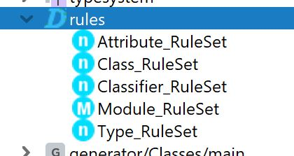

### EntityClassJava - An Entity to Class to Java transformation
In this example two Languages are defined, the Entities Language:
  

and the Classes Language:  

Rules are defined that transform instances of the Entities Language to instances of the Classes Language:

Also Rules are defined to transform instances of the Classes Language to Java (BaseLanguage) classes.

Two example entities (instances of the Entities Language) are also provided:  

The classes in the ExampleSolution/classes and ../java folders will be 'generated' by the defined Rules.   
Please experiment with editing the source entities and check how the rules (reactively) change the target classes and the java classes.
Also when a new entity is created in the Entities folder, it will immediately be transformed to a class in the classes folder and on its turn to a java class in the java folder.
(Note that no generation is required to transform the models!!)

Overview of this complete Example:

